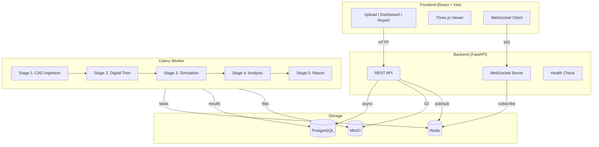

# Ergon

**CAD-to-Manipulation-Quality Platform** — Upload a CAD model and receive a robotic manipulation quality report through 5 automated pipeline stages.

## Quick Start

```bash
cp .env.example .env
make up
```

Services will be available at:

| Service | URL |
|---------|-----|
| Frontend | http://localhost:5173 |
| API | http://localhost:8000 |
| API Docs | http://localhost:8000/docs |
| Flower (task monitor) | http://localhost:5555 |
| MinIO Console | http://localhost:9001 |

## Architecture



## Pipeline Stages

```
CAD File → [1] Ingestion → [2] Digital Twin → [3] Simulation → [4] Analysis → [5] Report
```

### Stage 1: CAD Ingestion
Parses STL, OBJ, STEP, IGES, URDF, MJCF files. Extracts geometry, computes physical properties (mass, CoG, friction), applies user overrides.

### Stage 2: Physics-Ready Digital Twin
Generates collision meshes via convex decomposition, computes inertia tensors, derives MuJoCo contact parameters, builds complete MJCF model with environment.

### Stage 3: Robotic Manipulation Simulation
Runs MuJoCo simulations with a scripted grasp agent (Franka Panda). Executes grasp, reorient, use, and transfer tasks. Records telemetry + video.

### Stage 4: Data Collection & Analysis
Aggregates telemetry across trials. Computes grasp quality, stability, force analysis, task completion metrics. Generates 3D contact heatmaps.

### Stage 5: Report Generation
Calculates composite score (0-100), generates rule-based recommendations, builds PDF report.

## Commands

```bash
make up       # Start all 8 services
make down     # Stop all services
make build    # Rebuild Docker images
make logs     # Tail all logs (JSON structured)
make share    # Start with Cloudflare Tunnel for external access
make test     # Run backend tests
make clean    # Stop and remove all volumes
make migrate  # Run database migrations
```

## Tech Stack

| Layer | Technology |
|-------|-----------|
| Backend | Python 3.11, FastAPI, Celery, SQLAlchemy |
| Frontend | React 18, Vite, Three.js, TailwindCSS, Recharts |
| Simulation | MuJoCo 3.x (headless OSMesa) |
| Database | PostgreSQL 16 |
| Object Storage | MinIO |
| Queue/PubSub | Redis 7 |
| Task Monitor | Flower |
| Deployment | Docker Compose (ARM64 native) |
| Sharing | Cloudflare Tunnel |

## Environments

Five simulation environments are available:
- **Open Space** — minimal ground plane
- **Kitchen** — countertop with table
- **Workshop** — industrial workbench
- **Vehicle** — dashboard surface
- **Operating Room** — sterile surgical table

## Resource Allocation

| Service | Memory Limit |
|---------|-------------|
| Worker | 6 GB |
| Backend | 2 GB |
| PostgreSQL | 1 GB |
| MinIO | 1 GB |
| Redis | 512 MB |
| Frontend | 512 MB |
| Flower | 512 MB |
| **Total** | **~12 GB** |

Designed for Mac Mini M4 (16 GB RAM) with headroom.

## Sharing

```bash
# Set your Cloudflare Tunnel token in .env
echo "TUNNEL_TOKEN=your-token-here" >> .env

# Start with sharing enabled
make share
```

Anyone with the tunnel URL can access the full dashboard, upload CAD files, watch pipeline progress, and view reports. No port forwarding needed.

## Project Structure

```
├── backend/
│   ├── app/
│   │   ├── api/v1/          # REST endpoints
│   │   ├── core/            # Config, DB, logging
│   │   ├── models/          # SQLAlchemy models
│   │   ├── schemas/         # Pydantic schemas
│   │   ├── services/        # MinIO storage
│   │   ├── stages/          # 5 pipeline stages
│   │   │   ├── s1_ingestion/
│   │   │   ├── s2_digital_twin/
│   │   │   ├── s3_simulation/
│   │   │   ├── s4_analysis/
│   │   │   └── s5_report/
│   │   └── tasks/           # Celery orchestration
│   ├── alembic/             # DB migrations
│   ├── Dockerfile
│   └── requirements.txt
├── frontend/
│   ├── src/
│   │   ├── components/      # Reusable UI components
│   │   ├── hooks/           # React hooks
│   │   ├── lib/             # API client
│   │   └── pages/           # Route pages
│   ├── Dockerfile
│   └── package.json
├── docker-compose.yml
├── Makefile
└── .env.example
```
